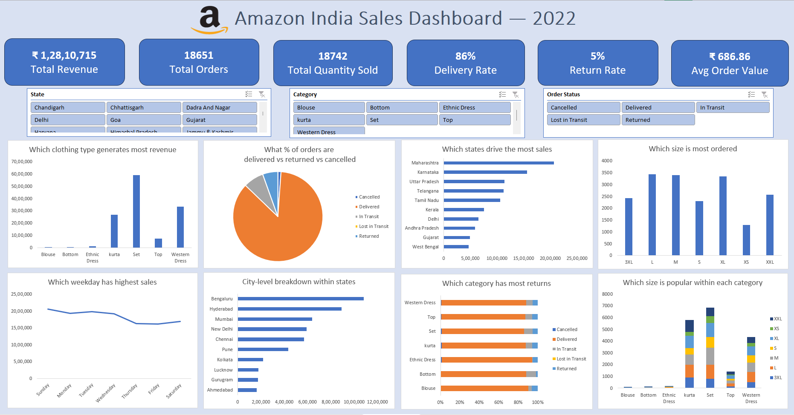

# Amazon India Sales Dashboard — 2022

## Overview
An interactive Excel dashboard analysing Amazon India sales data 
for April-May 2022 using Power Query and PivotTables.

## Tools Used
- Microsoft Excel
- Power Query (data cleaning)
- PivotTables & PivotCharts
- Slicers (interactive filtering)

## Dataset
Amazon India Sales Report — 18,651 orders across April-May 2022

## Data Source
Dataset sourced from Kaggle:
[Amazon India Sales Report](https://www.kaggle.com/datasets/thedevastator/unlock-profits-with-e-commerce-sales-data)

## Key Insights
- Maharashtra leads revenue at ₹20L+
- Set category dominates with highest revenue
- 86% delivery rate, only 5% return rate
- Bengaluru is the top city by sales
- Sunday records highest weekly sales

## Dashboard Preview

## Skills Demonstrated
Data cleaning, exploratory data analysis, 
dashboard design, business insights
